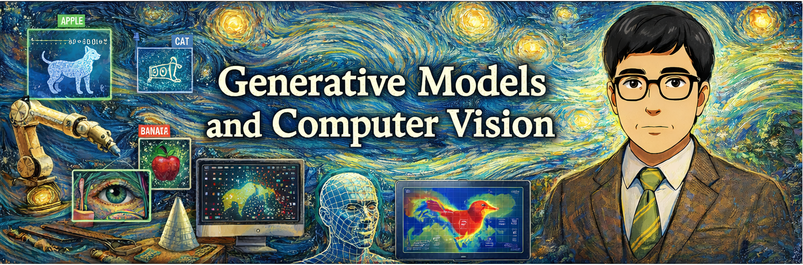

# Laboratorios de Computer Vision

## Laboratorio 1 – Conteo de Objetos mediante Visión Clásica
📁 **Ruta:** [`lab1/`](lab1)

Este laboratorio implementa el **conteo automático de objetos en movimiento** utilizando técnicas de visión computacional clásica, sin emplear modelos de Deep Learning.

Se trabajan dos casos de estudio:
- Conteo de atletas cruzando una línea de meta.
- Conteo de vacas cruzando un río.

**Técnicas utilizadas:**
- OpenCV
- Detección de movimiento
- Análisis de contornos
- Conteo por cruce de línea

📓 **Notebook:**  

## Laboratorio 2 – Detección de Residuos Plásticos mediante Deep Learning
📁 **Ruta:** [`lab2/`](lab2)

En este laboratorio se aborda la **detección automática de residuos plásticos en imágenes** mediante **modelos de Deep Learning**, empleando **YOLOv8** y un conjunto de datos anotado obtenido desde Roboflow Universe.

El trabajo incluye entrenamiento, evaluación e inferencia del modelo, así como análisis cuantitativo y cualitativo de los resultados.

**Técnicas utilizadas:**
- YOLOv8 (Ultralytics)
- Transferencia de aprendizaje
- Detección de objetos
- Evaluación mediante métricas y visualización de resultados

📓 **Notebook:**  

### Notas finales

Cada laboratorio incluye:
- Notebook ejecutable en Google Colab
- Resultados visuales
- Informe académico en formato PDF

