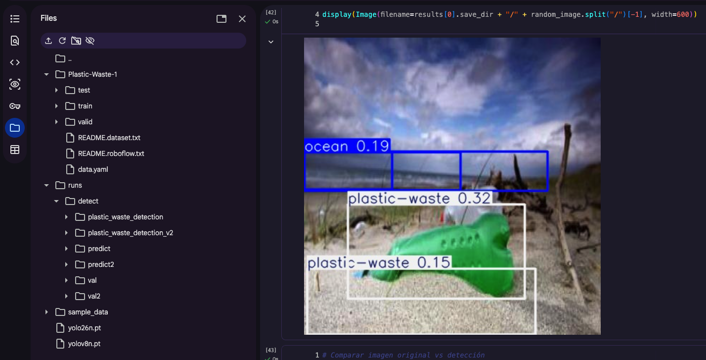
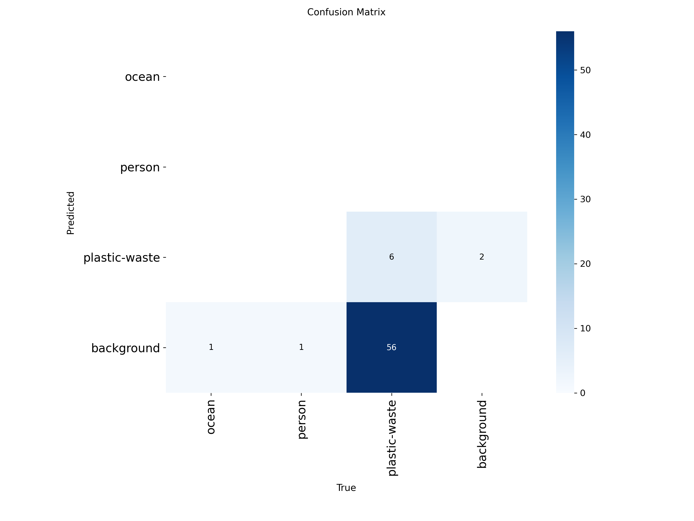
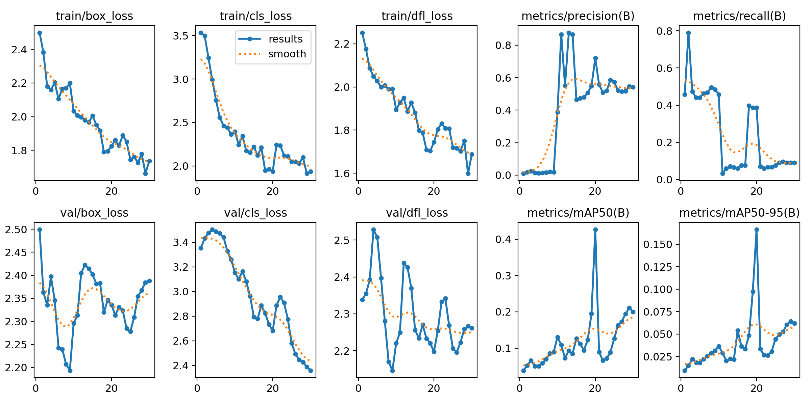
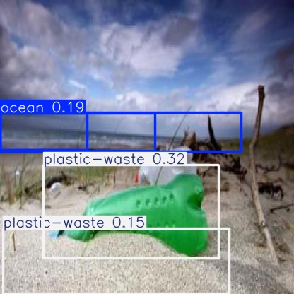
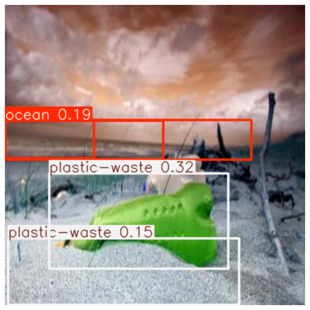
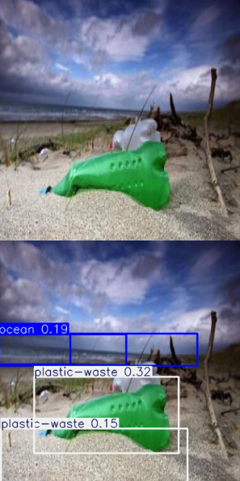

# Laboratorio 2 – Detección de Residuos Plásticos en Imágenes mediante YOLOv8

[](https://github.com/mc-ivan/computer-vision/blob/main/lab2/notebooks/Practica2_Grupo3.ipynb)

## Grupo 3
- Ivan Mamani  
- Yesica Luna  
- Elvis Miranda  
- Karem Huacota  
- Karen Torrico  

---
Este laboratorio aborda la **detección automática de residuos plásticos en entornos naturales** mediante técnicas de **Visión por Computador basadas en Deep Learning**.  
A diferencia del laboratorio anterior, en este trabajo se emplea un **modelo de detección de objetos YOLOv8**, entrenado mediante **transferencia de aprendizaje**, utilizando un conjunto de datos anotado obtenido desde **Roboflow Universe**.

## Objetivos

- Aplicar modelos de **detección de objetos basados en Deep Learning**.
- Utilizar un **dataset anotado** desde Roboflow Universe.
- Entrenar un modelo YOLOv8 mediante **transferencia de aprendizaje**.
- Evaluar el desempeño del modelo usando métricas como precisión y recall.
- Visualizar resultados de detección sobre imágenes reales.
- Comparar imágenes originales con imágenes inferidas por el modelo.

## Contenido del repositorio

```text
lab2/
├── notebooks
│   ├── Practica2_Grupo3.ipynb
│   └── Laboratorio2-Informe-Grupo3.pdf
└── sources
    ├── training_result.png
    ├── confusion_matrix.png
    ├── results.png
    ├── detection.png
    ├── last_detection.png
    └── comparisons.png
```

## Descripción de carpetas

- `notebooks/`  
  Contiene el notebook con toda la implementación y el informe final en PDF.

- `sources/`  
  Incluye las imágenes generadas durante el entrenamiento, evaluación e inferencia del modelo.

## Dataset

El conjunto de datos fue obtenido desde **Roboflow Universe**:

🔗 https://universe.roboflow.com/rahulrahul101099-gmail-com/plastic-waste-o7ob0

El dataset incluye imágenes anotadas de residuos plásticos y se descargó en formato compatible con **YOLOv8**, con divisiones de entrenamiento, validación y prueba.

## Resultados y visualizaciones

| Resultado | Descripción | Imagen |
|---------|-------------|--------|
| Entrenamiento del modelo | Evolución del entrenamiento y convergencia del modelo YOLOv8 a lo largo de las épocas. |  |
| Matriz de confusión | Análisis del desempeño del modelo en la clasificación de residuos plásticos. |  |
| Métricas del modelo | Métricas de precisión, recall y pérdida obtenidas durante el entrenamiento. |  |
| Detección de residuos | Ejemplo de detección de residuos plásticos mediante bounding boxes generados por el modelo. |  |
| Última inferencia | Resultado de inferencia utilizando el modelo entrenado con los mejores pesos (best.pt). |  |
| Comparación visual | Comparación entre la imagen original y la imagen inferida por el modelo entrenado. |  |


## Notebook del laboratorio

El notebook incluye:

- Descarga del dataset desde Roboflow.
- Configuración del entorno en Google Colab.
- Entrenamiento del modelo YOLOv8.
- Evaluación mediante métricas y matriz de confusión.
- Inferencia sobre imágenes de prueba.
- Comparación visual de resultados.

**Notebook:**  
[](https://github.com/mc-ivan/computer-vision/blob/main/lab2/notebooks/Practica2_Grupo3.ipynb)


## Informe de laboratorio

**Informe de Laboratorio:** [Informe](/lab2/notebooks/Laboratorio2-Informe-Grupo3.pdf)
